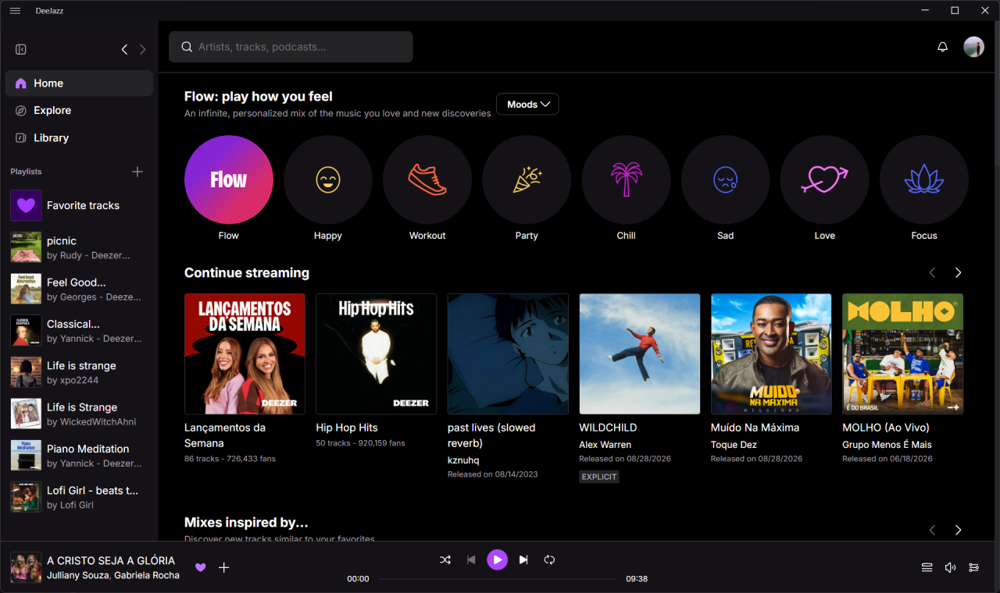

# DeeJazz

## Integrated with uBlock Origin Lite

DeeJazz is a focused desktop music experience for Windows and Linux. It combines a dedicated player, native desktop integration, keyboard shortcuts, and built-in uBlock Origin Lite protection in one clean application.



## Highlights

- Built-in uBlock Origin Lite protection
- Native Windows and Linux packages
- Media keys, tray controls, and desktop notifications
- English and Portuguese interfaces
- Automatic updates through GitHub Releases

## Download

Download the latest installers from [GitHub Releases](https://github.com/ryahconstantino/deejazz/releases/latest).

Linux users can also install DeeJazz with:

```bash
curl -fsSL https://raw.githubusercontent.com/ryahconstantino/deejazz/master/scripts/install-linux.sh | sh
```

## Build the desktop application

Requirements: Git, Git LFS, Node.js 20 or newer, and npm.

```bash
git clone https://github.com/ryahconstantino/deejazz.git
cd deejazz
git switch master
git lfs pull
npm install
npm run dist:win
```

For Linux x64:

```bash
npm run dist:linux
```

For Linux ARM64:

```bash
npm run dist:linux:arm64
```

## Build the website

The website source and its GitHub Pages output live on the `pages` branch.

```bash
git switch pages
npm install
npm run dev
npm run build
```

`npm run build` compiles the site into `.pages-build`. Use `npm run publish:local` to also refresh the static files served from the branch root.

The white, text-only wordmark is stored as outlines in `public/assets/images/branding/deejazz-wordmark.svg`. It does not load a font. Run `npm run assets:branding` to regenerate its PNG export and the Open Graph images from that SVG, then rebuild the website.
