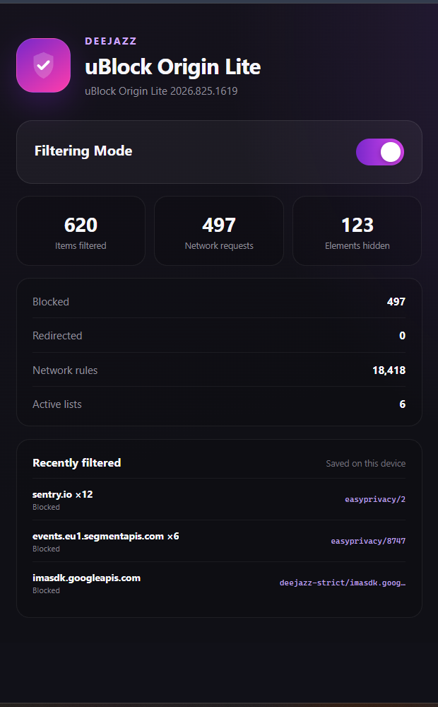

# DeeJazz

## Integrated with uBlock Origin Lite

DeeJazz is a desktop music player for Windows and Linux. It combines a focused listening experience with built-in uBlock Origin Lite filtering, DeeJazz cosmetic rules, media controls, system tray support, and a localized blocker dashboard.


## Highlights

- Built-in uBlock Origin Lite with 71 interface languages
- Network and cosmetic filtering enabled at application startup
- Dedicated blocker dashboard with persistent filtering history
- Windows x64 installer
- Portable Linux builds for AMD64 and ARM64
- Android APK with DeeJazz name, icons and artwork
- Linux MPRIS media controls, tray integration, and Wayland support

## Built-in protection

The localized uBlock Origin Lite dashboard shows active filtering, persistent counters, enabled lists, and recently filtered requests.



## Download

Download the latest Windows, Linux and Android packages from [GitHub Releases](https://github.com/ryahconstantino/deejazz/releases/latest).

Linux users can install the latest compatible package without `sudo`:

```bash
curl -fsSL https://raw.githubusercontent.com/ryahconstantino/deejazz/master/scripts/install-linux.sh | sh
```

## Build from source

Desktop runtime files live in `desktop/`. The decoded Android project lives in
`android/app/`; see [Android build and signing instructions](android/README.md).
Android contains editable resources and Smali, not the original Java/Kotlin
source. Only its application name and brand artwork have been changed.

Install Node.js, npm, Git, and Git LFS. Then clone the repository and install its dependencies:

```bash
git clone git@github.com:ryahconstantino/deejazz.git
cd deejazz
git lfs pull
npm install
```

The release version is defined by `DEEJAZZ_VERSION` in `.env.build`. Synchronize the metadata and apply the DeeJazz integration with:

```bash
npm run version:sync
npm run app:integrate
```

Build the Windows x64 installer:

```bash
npm run dist:win
```

Build the portable Linux packages:

```bash
npm run dist:linux
npm run dist:linux:arm64
```

Generated files are written to `dist/`:

- `deejazz-windows-x64-1.2.3.exe`
- `deejazz-linux-amd64-1.2.3.tar.gz`
- `deejazz-linux-arm64-1.2.3.tar.gz`

Filenames use the release version from `DEEJAZZ_VERSION` (or `.env.build` for
local builds). Linux packages and the Android APK include SHA-256 checksum files.
The Linux installer resolves the latest version automatically and also supports
older releases with unversioned filenames.

## Automated releases

GitHub Actions builds the Windows x64 installer, both Linux packages and the
signed Android APK, then publishes them to a GitHub Release. Android outputs are
written to `Dist/`; desktop outputs remain in `dist/`. Configure the Android
signing secrets described in [android/README.md](android/README.md), then push a
semantic-version tag to start a release:

```bash
git tag v1.2.3
git push origin v1.2.3
```

You can also run **Build and publish release** manually from the Actions tab and provide the version to publish. The workflow attaches the desktop packages and the Android APK with its SHA-256 checksum.

## License

DeeJazz is released under the [MIT License](LICENSE).

## Website

The DeeJazz website is published from the root of the [`pages`](https://github.com/ryahconstantino/deejazz/tree/pages) branch.
